# 🔒 Celock

**Turn Bot Traffic into Revenue with Celo Micropayments.** *The plug-and-play firewall that makes bots pay their way, built on `HTTP 402`.*

**🏆 A Hackathon ORIGINS @ TOKEN2049 Project**

## 💡 The Big Idea

The web is drowning in automated traffic. Bots, scrapers, and AI agents generate billions of requests, consuming vast resources and creating unsustainable costs for developers and creators. The old defenses—CAPTCHAs and IP bans—are failing. They punish legitimate users and offer no way to capture the value this traffic generates.

**Celock flips the script.** We transform parasitic bot traffic into a sustainable, machine-native economy. Using the underutilized `HTTP 402 Payment Required` standard and the speed of Celo, Celock is a simple firewall that challenges automated clients to pay for the resources they consume.

No more free rides. If a bot wants your data, it has to pay for it—instantly, transparently, and fairly.

## 🌪️ The Problem

  - **💸 Unmonetized Traffic:** Bots and AI agents consume massive bandwidth and compute power, almost always for free.
  - **📈 Spiraling Costs:** Every bot request incurs real infrastructure costs, directly eating into your margins.
  - **🚫 Broken Defenses:** CAPTCHAs and IP bans are blunt instruments that create friction for users and are easily bypassed by sophisticated bots.
  - **🌉 Missing Infrastructure:** There is no seamless, standardized way for machines to pay other machines for API calls or data access.

## 🚀 Our Solution: The Celock Protocol

Celock is a lightweight, plug-and-play proxy that sits in front of any existing API or web service. It enforces payment-gated access without requiring any changes to your core application logic.

#### The Flow in Action:

```mermaid
sequenceDiagram
    participant Bot as 🤖 Compliant Bot
    participant Celock as 🔒 Celock Proxy
    participant Celo as 🪙 Celo Blockchain
    participant Server as 🖥️ Your API/Server

    Bot->>Celock: 1. Request data (e.g., GET /api/data)
    Celock-->>Bot: 2. Challenge with HTTP 402 (Invoice ID + Price)
    Bot->>Celo: 3. Pays invoice in cUSD to Smart Contract
    Celo-->>Bot: Transaction Confirmed
    Bot->>Celock: 4. Retry request with Proof of Payment (Tx Hash)
    Celock->>Celo: 5. Verifies payment on-chain
    Celo-->>Celock: Payment Valid
    Celock->>Server: 6. Forwards original request
    Server-->>Celock: Serves resource
    Celock-->>Bot: 7. Success! (HTTP 200 + Data)
```

## 🛠️ Key Features

  - ⚡ **Instant `402` Enforcement:** A non-intrusive Node.js/Express proxy that adds a payment layer to any endpoint.
  - 🪙 **Gas-Efficient Celo Contract:** A lightweight Solidity smart contract for fast, low-cost on-chain payment verification.
  - 🤖 **Bot Agent SDK:** A simple SDK in Python & JS that automates the `402` payment handshake for compliant bots.
  - 📊 **Revenue Dashboard:** A clean interface to track paid vs. blocked requests, monitor revenue, and analyze traffic patterns.

## 📦 Use Cases

  - **🤖 API Providers:** Monetize every single automated call, turning a cost center into a new revenue stream.
  - **📰 Content Platforms:** Protect valuable content from scrapers while allowing paid, programmatic access for legitimate AI agents.
  - **🧠 AI Agent Platforms:** Enable AI agents to autonomously pay for the data they need, creating a true pay-as-you-go machine economy.

## 💰 Business Model

Celock is designed for flexibility and scale:

  - **Pay-per-Request:** A small fee is taken from each successful micropayment.
  - **Prepaid Credits:** Bots can pre-purchase credits for uninterrupted access.
  - **Tiered Subscriptions:** Offer premium tiers with lower fees, higher rate limits, or surge protection.
  - **Enterprise SaaS:** Provide Celock as a managed service for large-scale API providers.

## 🧠 Tech Stack

  - **Proxy Server:** Node.js, Express.js
  - **Blockchain:** Solidity on Celo (Mainnet)
  - **Web3 Interaction:** ethers.js, Web3.js
  - **Agent SDK:** Python, JavaScript

-----

## 🧾 License

This project is licensed under the **MIT License**. Use it, fork it, build something amazing on it.

-----

## 🧠 Made at Hackathon ORIGINS TOKEN2049

**By The FinalBOSS Squad**

  - **Guilherme dos Santos de Almeida Silva** – `gsantos@bankbook.com.br`
  - **Ademola Adebowale** – `ademolajohn844@gmail.com`
  - **Kwang Wei Sim** – `kwang@adappter.xyz`
  - **Samuel Danso** – `me.samueldanso@gmail.com`
